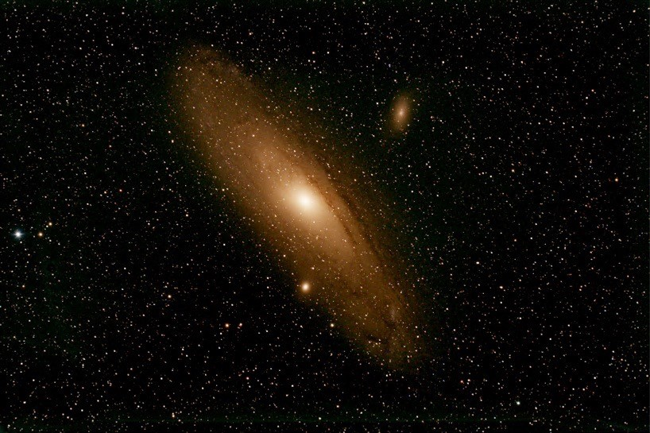
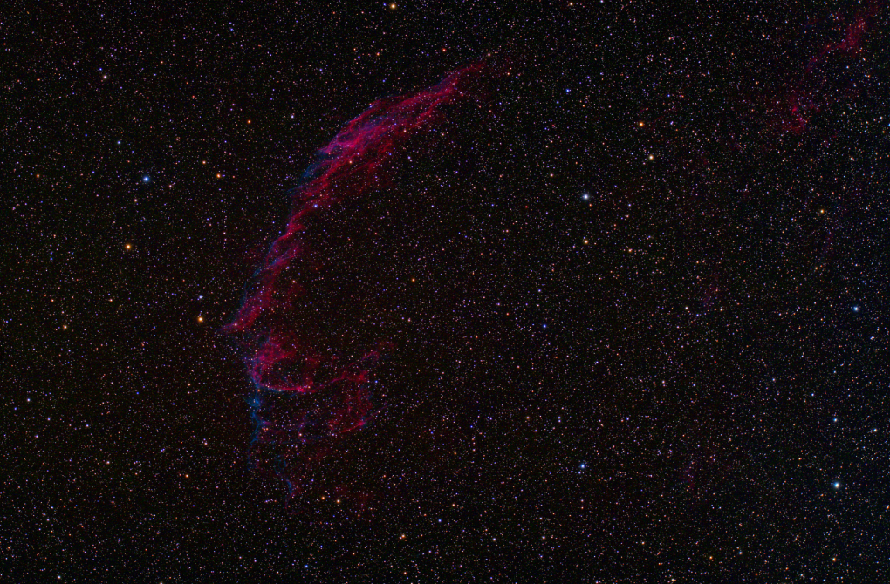

### M31
My most recent work is of Andromeda, also known as M31, taken on December 21st, 2020. It is the closest galaxy to our own, and in a couple billion years it will collide with us. I took this image with my friend, Luke. He is currently writing a magazine article on the process of taking such an image, and when it is down, I will post it for anyone that is curious about all the work that goes into one image. You might be thinking “Isn't M31 a spiral galaxy, why is it red and not blue?” Well, that is a good question and Luke, and it is because the DLSR camera we use has a hydrogen alpha sensitivity. This translates to a redder image. 

     

### Eastern Veil Nebula
The first piece of astrophotography is of the Eastern Veil Nebula. I took this in Astro-lab course as my final project. My lab partner and I sat in the dome of the Allegheny Observatory and took data for a couple of hours when the skies were clear. Unfortunately, early in the semester there were wildfires in California causing the atmosphere to be hazy. Crazy to think the wildfires on the other side of the country would affect us in Pittsburgh. To get usable data we had to observe in the winter, we had to sit in the observatory dome for 2 hours in 20-degree weather. However, overserving in the winter is optimal condition because the atmosphere has less moisture in the air which means the light traveling from the Eastern Veil Nebula interacts with less atmosphere giving us a crisper image. The full image is 500MBs and that seems a little too large to put onto a website. If anyone wants to see the full image, please send me an email. 

